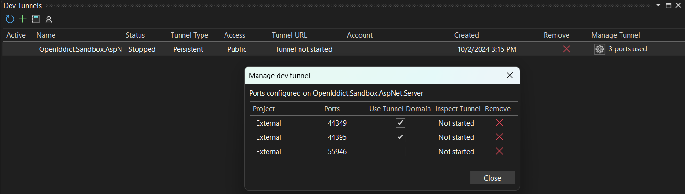

# Using Microsoft dev tunnels <Badge type="warning" text="client" /><Badge type="danger" text="server" />

When developing an ASP.NET or ASP.NET Core-based web application running on your developer machine, you can usually directly connect to the server
using the pre-configured `applicationUrl` (e.g `https://localhost:44359/`). If you are, however, developing an Android or iOS application
using MAUI or Avalonia, the application will run either on a physical device or on a local emulator/simulator and using `localhost` may not be an option.

To work around that, you can use
[Microsoft dev tunnels](https://learn.microsoft.com/en-us/azure/developer/dev-tunnels/overview), that are available for both
[Visual Studio Code](https://code.visualstudio.com/docs/editor/port-forwarding) and
[Visual Studio](https://learn.microsoft.com/en-us/aspnet/core/test/dev-tunnels?view=aspnetcore-8.0).

Explaining these tools in detail is outside the scope of this guide. For that, refer to the following links to:
- [Create a dev tunnel in Visual Studio Code](https://code.visualstudio.com/docs/editor/port-forwarding).
- [Create a dev tunnel in Visual Studio 2022](https://learn.microsoft.com/en-us/aspnet/core/test/dev-tunnels).

## Change the issuer <Badge type="warning" text="client" />

In order to use the tunnel, you need to change the `Issuer` of the client
registration in the client project to point to the tunnel URL (e.g. `MauiProgram.cs`):

```csharp
services.AddOpenIddict()
    .AddClient(options =>
    {
        // ...

        // Add a client registration matching the client application definition in the server project.
        options.AddRegistration(new OpenIddictClientRegistration
        {
            Issuer = new Uri("https://localhost:44395/", UriKind.Absolute), // [!code --]
            Issuer = new Uri("https://contoso.euw.devtunnels.ms/", UriKind.Absolute), // [!code ++]
            ProviderName = "Local",

            ClientId = "maui",

            // This sample uses protocol activations with a custom URI scheme to handle callbacks.
            //
            // For more information on how to construct private-use URI schemes,
            // read https://www.rfc-editor.org/rfc/rfc8252#section-7.1 and
            // https://www.rfc-editor.org/rfc/rfc7595#section-3.8.
            PostLogoutRedirectUri = new Uri("com.openiddict.sandbox.maui.client:/callback/logout/local", UriKind.Absolute),
            RedirectUri = new Uri("com.openiddict.sandbox.maui.client:/callback/login/local", UriKind.Absolute),

            Scopes = { Scopes.Email, Scopes.Profile, Scopes.OfflineAccess, "demo_api" }
        });

    });
```

> [!WARNING] Use the tunnel domain
>
> One common pitfall with Microsoft dev tunnels is that they do not forward their domain name to the server but direct traffic to `localhost`.
> This means that even though you connect to your server using the dev tunnels URL (e.g. `https://contoso.euw.devtunnels.ms/`),
> the request URL on your server will be `https://localhost:44359/`. 
>
> This causes a variety of issues such as:
> - The request forgery protection feature not working correctly due to the antiforgery cookie
created using the tunnel domain (and thus not served to `localhost`) being lost in the process.
>
> - The OpenIddict client stack not being able to connect to the server from a remote machine (e.g. Android emulator) due to the server metadata
> (`/.well-known/openid-configuration`) containing endpoints starting with `https://localhost:44359/` instead of the dev tunnel URL.
>
> To fix this, you **MUST** check the _Use Tunnel Domain_ checkbox in the _Manage dev tunnel_ dialog:
>
> 

## Add a binding for IIS Express <Badge type="danger" text="server" />

When running your authorization server in IIS Express, you will also have edit the _applicationhost.config_ file and add a binding for your dev
tunnel (otherwise you will get an error message when trying to connect to your authorization server via the tunnel URL).

> [!TIP]
> For example, if your application listens on `https://localhost:44359/` locally and your tunnel URL is `https://contoso.euw.devtunnels.ms/`:
> 
> ```xml
> <bindings>
>   <binding protocol="http" bindingInformation="*:55946:localhost" />
>   <binding protocol="https" bindingInformation="*:44359:localhost" />
>   <binding protocol="https" bindingInformation="*:44359:contoso.euw.devtunnels.ms" /> <!-- [!code add] -->
> </bindings>
> ```

## Inspect network traffic

In case you want to trace or inspect the network traffic of your dev tunnel, simply add `-inspect` after the host name of your URL.

For example, `https://contoso.euw.devtunnels.ms/` must be changed to `https://contoso-inspect.euw.devtunnels.ms/`.
